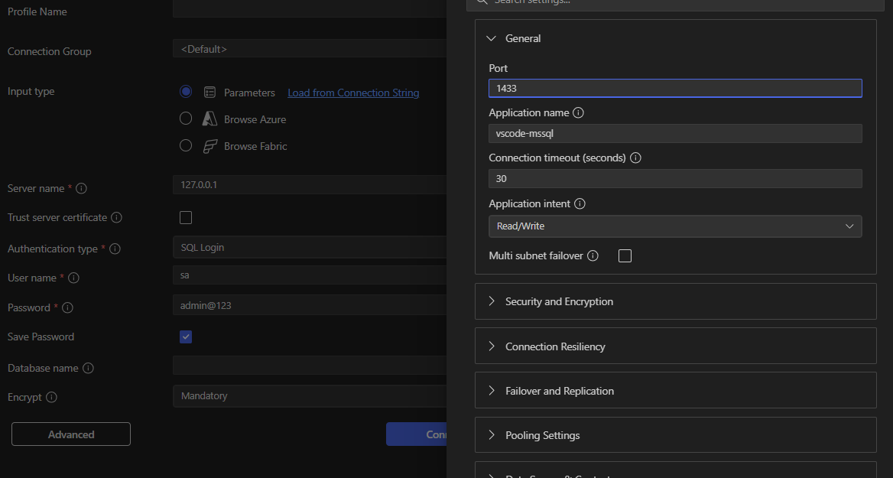

# Cài đặt Docker và SQL Server

## 1. Cài Docker

- Tải và cài Docker theo hướng dẫn chính thức của Docker.

## 2. Cài SQL Server Extension trên VSCode

- Mở VSCode → Extensions → tìm **SQL Server** → cài đặt.
- Extension này giúp kết nối và kiểm tra database dễ dàng.

## 3. Kết nối tới SQL Server

- Sử dụng SQL Server extension để điền các thông tin kết nối:

  - Server name
  - Authentication type
  - Username
  - Password
  - Database name

  | Mục                | Ví dụ điền                                           |
  | ------------------ | ---------------------------------------------------- |
  | **Server name**    | `localhost,1433` hoặc `127.0.0.1,1433`               |
  | **Authentication** | `SQL Login`                                          |
  | **Username**       | `sa`                                                 |
  | **Password**       | `admin@123`                                          |
  | **Database name**  | `master` (hoặc tên database bạn tạo, ví dụ `TestDB`) |

## 4. Hình minh họa

